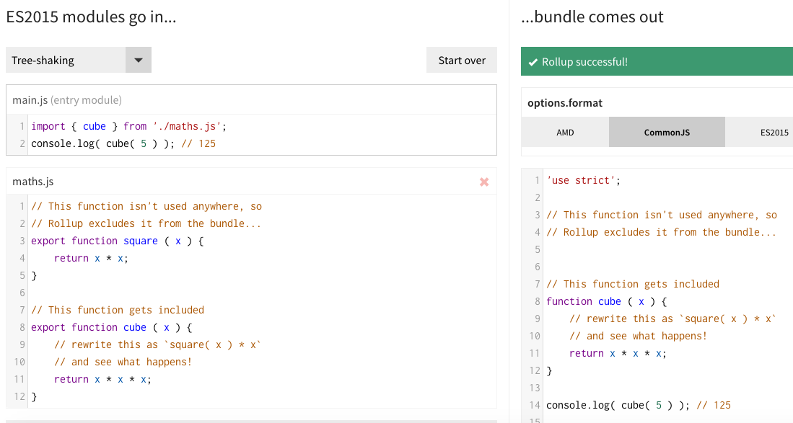
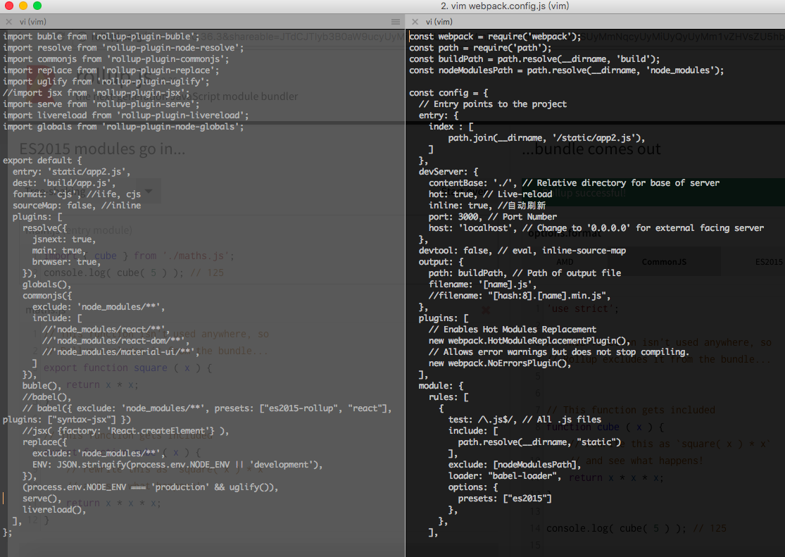
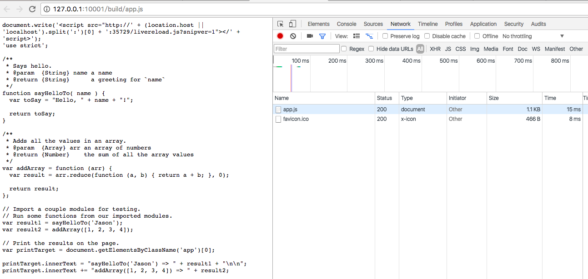

## Rollup
下一代的模块打包工具，使用了一种被称为[tree-shaking](https://www.zhihu.com/question/41922432)的黑科技技术，利用ES6模块能静态分析语法树的特性，只将需要的代码提取出来打包，能大大减小代码体积。

### 解决前端工程化的另一种`更好`的方案：Rollup.js

#### 1. 更小的体积
通过rollup打包出来的文件体积小，原因是它通过静态分析语法树,知道哪些代码从来没有被使用过，把多余代码去掉，只打包有用的代码。

看[官网](http://rollupjs.org)的首页例子就很明显了    



左边是打包前代码，引入了maths.js库，但main.js只使用了其中一个方法 ；  
右边是打包后的代码，可以看到，只有被使用的方法，对于在项目中引入第三方类库尤其实用。

#### 2. 更容易理解配置
更容易理解的配置，是相对于webpack而言的，rollup的配置更自然，更简洁一些。

下面可以对比下实现相同业务的代码，所需要的rollup和webpack配置


左侧是rollup 配置文件   
右侧是webpack2 配置文件

还有一点，rollup打包后的文件更接近源码，而webpack则会用`__webpack_require__`额外包一层，初学者一看打包后的代码就一脸懵逼。

#### 3. 丰富的插件
既然说是`更好`的方案，必须要能解决实际项目中各种各样的问题，就像webpack那样，拥有丰富的插件，rollup的插件列表：
[plugins](https://github.com/rollup/rollup/wiki/Plugins)

常用的插件有：
```js
import buble from 'rollup-plugin-buble';
import resolve from 'rollup-plugin-node-resolve';
import commonjs from 'rollup-plugin-commonjs';
import globals from 'rollup-plugin-node-globals';
import replace from 'rollup-plugin-replace';
import uglify from 'rollup-plugin-uglify';
import serve from 'rollup-plugin-serve';
import livereload from 'rollup-plugin-livereload';
```

#### 4. webpack能做的，rollup也能做到
看看rollup插件列表就知道了！

### 入门实例

#### 1. 新建项目
```
mkdir rollup-demo
cd rollup-demo
npm init
```

执行完之后，会在rollup-demo目录下自动生成package.json。

#### 2. 安装rollup及其插件
```
npm install --save-dev rollup
```

然后，创建一个rollup.config.js配置文件，最少配置项如下：
```
export default {
  entry: 'index.js',    //需要打包的文件
  dest: 'build/main.min.js',  //打包后的文件
  format: 'iife',       // iife / cjs
  sourceMap: 'inline',  //debug代码时有用，线上环境设置为false
};
```

就这样，我们现在已经可以用rollup来打包我们的index.js文件了，试下：
```
./node_modules/.bin/rollup -c

drwxr-xr-x  3 caidavis  staff  102 11 22 23:21 build
-rwxr-xr-x@ 1 caidavis  staff  820 11 22 23:17 index.js
drwxr-xr-x  6 caidavis  staff  204 11 22 23:09 node_modules
-rw-r--r--  1 caidavis  staff  259 11 22 23:09 package.json
-rw-r--r--  1 caidavis  staff  233 11 22 23:17 rollup.config.js
```

打包后的文件在build目录下，打开看下
```js
(function () {
'use strict';

/**
 * Says hello.
 * @param  {String} name a name
 * @return {String}      a greeting for `name`
 */
function sayHelloTo( name ) {
  const toSay = `Hello, ${name}!`;

  return toSay;
}

/**
 * Adds all the values in an array.
 * @param  {Array} arr an array of numbers
 * @return {Number}    the sum of all the array values
 */
const addArray = arr => {
  const result = arr.reduce((a, b) => a + b, 0);

  return result;
};

// Import a couple modules for testing.
// Run some functions from our imported modules.
const result1 = sayHelloTo('Jason');
const result2 = addArray([1, 2, 3, 4]);

// Print the results on the page.
const printTarget = document.getElementsByClassName('app')[0];

printTarget.innerText = `sayHelloTo('Jason') => ${result1}\n\n`;
printTarget.innerText += `addArray([1, 2, 3, 4]) => ${result2}`;

}());
```

发现跟源码几乎一样，只是用iife方式包裹起来了，iife 是`immediately-invoked function expression`，

```
(function () {
'use strict';

    //source code

}());
```

我们知道rollup的tree-shaking特性只打包有用的代码，那我们来修改下源码，调用`sayHelloTo()`的代码都注释掉，看打包后的代码还有没有`sayHelloTo()`方法体

```js
(function () {
'use strict';

/**
 * Says hello.
 * @param  {String} name a name
 * @return {String}      a greeting for `name`
 */
/**
 * Adds all the values in an array.
 * @param  {Array} arr an array of numbers
 * @return {Number}    the sum of all the array values
 */
const addArray = arr => {
  const result = arr.reduce((a, b) => a + b, 0);

  return result;
};

// Import a couple modules for testing.
// Run some functions from our imported modules.
//const result1 = sayHelloTo('Jason');
const result2 = addArray([1, 2, 3, 4]);

// Print the results on the page.
const printTarget = document.getElementsByClassName('app')[0];

//printTarget.innerText = `sayHelloTo('Jason') => ${result1}\n\n`
printTarget.innerText += `addArray([1, 2, 3, 4]) => ${result2}`;

}());
```

可以看到，打包后的代码已没有`sayHelloTo()`方法了。


#### 3. 支持babel,ES6等

```
# Install Rollup’s Babel plugin.
npm install --save-dev rollup-plugin-babel

# Install the Babel preset for transpiling ES2015 using Rollup.
npm install --save-dev babel-preset-es2015-rollup

```

在项目根目录下创建`.babelrc`文件，写入：
```
{
  "presets": ["es2015-rollup"],
}
```

修改rollup.config.js配置文件：

```
// Rollup plugins
import babel from 'rollup-plugin-babel';

export default {
  entry: 'index.js',    //需要打包的文件
  dest: 'build/main.min.js',  //打包后的文件
  format: 'iife',       // iife / cjs
  sourceMap: 'inline',  //debug代码时有用，线上环境设置为false
  plugins: [
    babel({
      exclude: 'node_modules/**',
    }),
  ],
};
```

执行 `./node_modules/.bin/rollup -c`，看看生成的文件。

可以看到，源码的箭头函数被转换成了常见的函数：
```js
const addArray = arr => {
  const result = arr.reduce((a, b) => a + b, 0);

  return result;
};

var addArray = function addArray(arr) {
  var result = arr.reduce(function (a, b) {
    return a + b;
  }, 0);

  return result;
};
```

如果entry目标文件>100KB，执行命令后，会看到警告提示：[BABEL] Note: The code generator has deoptimised the styling of "..." as it exceeds the max of "100KB"，看看[babel option](http://babeljs.io/docs/usage/options/) 给出的解释：
```
compact	"auto" : Do not include superfluous whitespace characters and line terminators. When set to "auto" compact is set to true on input sizes of >100KB.
```

```
plugins: [
  babel({
    compact: true, // 事实上，只要不为auto就不会警告
    exclude: 'node_modules/**',
  }),
],
```

#### 4. 解决加载第三方模块，提示：ReferenceError ：xxx is not defined

```
npm install --save-dev rollup-plugin-node-resolve rollup-plugin-commonjs
```

`rollup-plugin-node-resolve`, 允许加载node_modules目录下的第三方模块  
`rollup-plugin-commonjs`，把CommonJS模块转换为ES6

更新 rollup.config.js 配置文件：

```
// Rollup plugins
import babel from 'rollup-plugin-babel';
import resolve from 'rollup-plugin-node-resolve';
import commonjs from 'rollup-plugin-commonjs';

export default {
  entry: 'index.js',    //需要打包的文件
  dest: 'build/main.min.js',  //打包后的文件
  format: 'iife',       // iife / cjs
  sourceMap: 'inline',  //debug代码时有用，线上环境设置为false
  plugins: [
    resolve({
      jsnext: true,
      main: true,
      browser: true,
    }),
    commonjs(),
    babel({
      compact: true, // 事实上，只要不为auto就不会警告
      exclude: 'node_modules/**',
    }),
  ],
};
```

#### 5. UglifyJS压缩代码

```
npm install --save-dev rollup-plugin-uglify
```

更新 rollup.config.js 配置文件：

```
// Rollup plugins
import babel from 'rollup-plugin-babel';
import resolve from 'rollup-plugin-node-resolve';
import commonjs from 'rollup-plugin-commonjs';
import uglify from 'rollup-plugin-uglify';

export default {
  entry: 'index.js',    //需要打包的文件
  dest: 'build/main.min.js',  //打包后的文件
  format: 'iife',       // iife / cjs
  sourceMap: 'inline',  //debug代码时有用，线上环境设置为false
  plugins: [
    resolve({
      jsnext: true,
      main: true,
      browser: true,
    }),
    commonjs(),
    babel({
      compact: true, // 事实上，只要不为auto就不会警告
      exclude: 'node_modules/**',
    }),
    (process.env.NODE_ENV === 'production' && uglify()),
  ],
};
```
执行 `NODE_ENV=production ./node_modules/.bin/rollup -c` ，对比下压缩前后的代码体积

```
-rw-r--r--  1 caidavis  staff  2749 11 23 00:24 main.min.js  //压缩前
-rw-r--r--  1 caidavis  staff  1909 11 23 00:24 main.min.js  //压缩后
```

#### 6. 类似webpack-dev-server的插件

`rollup-plugin-serve`: serve your bundle just like webpack-dev-server
```
npm install --save-dev rollup-plugin-serve
```

该插件默认配置：
```
// Default options
serve({
  // Folder to serve files from,
  contentBase: '',

  // Set to true to return index.html instead of 404
  historyApiFallback: false,

  // Options used in setting up server
  host: 'localhost',
  port: 10001
})
```

更新rollup.config.js配置文件：
```
// Rollup plugins
import babel from 'rollup-plugin-babel';
import resolve from 'rollup-plugin-node-resolve';
import commonjs from 'rollup-plugin-commonjs';
import uglify from 'rollup-plugin-uglify';
import serve from 'rollup-plugin-serve';

export default {
  entry: 'index.js',    //需要打包的文件
  dest: 'build/main.min.js',  //打包后的文件
  format: 'iife',       // iife / cjs
  sourceMap: 'inline',  //debug代码时有用，线上环境设置为false
  plugins: [
    resolve({
      jsnext: true,
      main: true,
      browser: true,
    }),
    commonjs(),
    babel({
      compact: true, // 事实上，只要不为auto就不会警告
      exclude: 'node_modules/**',
    }),
    (process.env.NODE_ENV === 'production' && uglify()),
    serve(), // index.html should be in root of project
  ],
};
```

#### 7. 模块热替换(HMR)插件

`rollup-plugin-livereload` : refresh the page when your bundle changes

```
npm install --save-dev rollup-plugin-livereload
```

更新 rollup.config.js 配置：

```
// Rollup plugins
import babel from 'rollup-plugin-babel';
import resolve from 'rollup-plugin-node-resolve';
import commonjs from 'rollup-plugin-commonjs';
import uglify from 'rollup-plugin-uglify';
import serve from 'rollup-plugin-serve';
import livereload from 'rollup-plugin-livereload';

export default {
  entry: 'index.js',    //需要打包的文件
  dest: 'build/main.min.js',  //打包后的文件
  format: 'iife',       // iife / cjs
  sourceMap: 'inline',  //debug代码时有用，线上环境设置为false
  plugins: [
    resolve({
      jsnext: true,
      main: true,
      browser: true,
    }),
    commonjs(),
    babel({
      compact: true, // 事实上，只要不为auto就不会警告
      exclude: 'node_modules/**',
    }),
    (process.env.NODE_ENV === 'production' && uglify()),
    serve(), // index.html should be in root of project
    livereload(),
  ],
};
```


#### 最后，rollup和webpack2 实际打包效果对比
rollup.js和webpack2 打包后文件大小对比，均未压缩处理，都关闭了sourceMap。

rollup.js 打包后文件1.1kb



webpack2 打包后文件27kb
```
$ webpack --config webpack.config.js
Hash: e307042b7b78c57984ee
Version: webpack 2.1.0-beta.27
Time: 1122ms
   Asset     Size  Chunks             Chunk Names
index.js  27.8 kB       0  [emitted]  index
```


### 参考
1. [How to Bundle JavaScript With Rollup](https://code.lengstorf.com/learn-rollup-js/)
2. [Rollup plugins](https://github.com/rollup/rollup/wiki/Plugins)
3. [The cost of small modules](https://nolanlawson.com/2016/08/15/the-cost-of-small-modules/)
4. [Rollup’s CLI docs](https://github.com/rollup/rollup/wiki/Command-Line-Interface)
